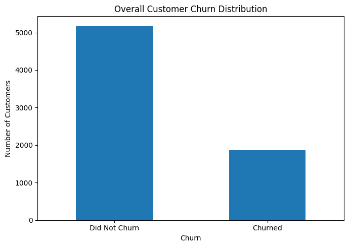
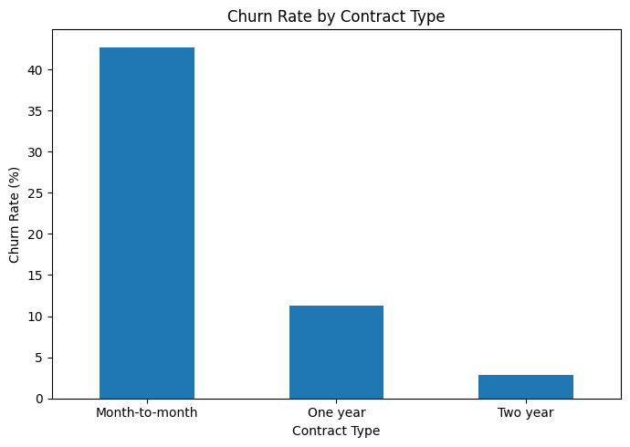
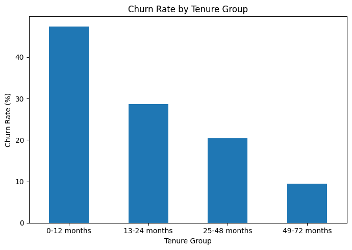
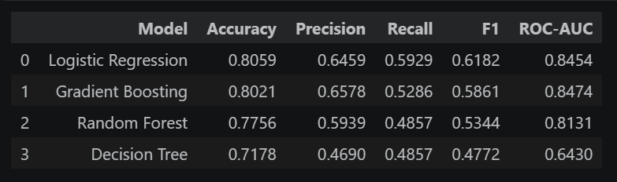
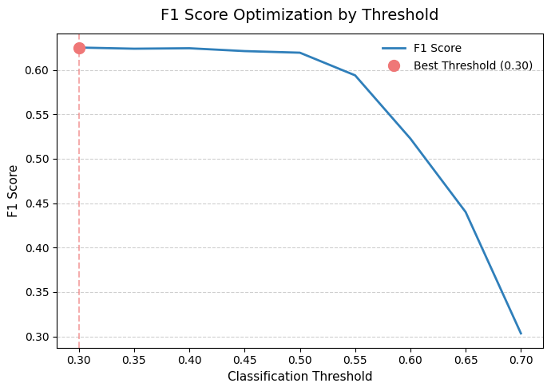
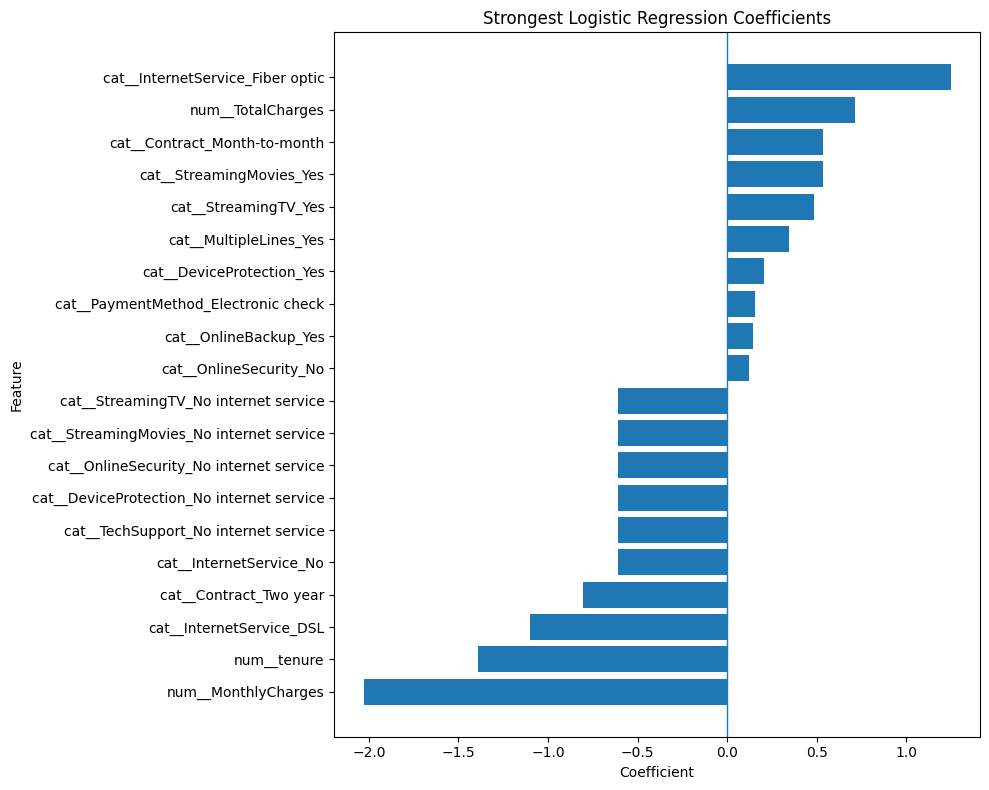

# Customer Churn Prediction 📊

<p align="center">
  <a href="YOUR_STREAMLIT_APP_URL">🌐 Live Streamlit App</a>
  &nbsp;•&nbsp;
  <a href="YOUR_GITHUB_REPOSITORY_URL">🐙 GitHub Repository</a>
</p>
<p align="center">
  <a href="YOUR_DEMO_VIDEO_URL">🎥 Project Demo Video</a>
</p>

---

## 1. Overview
This project presents an end-to-end classical machine learning and predictive analytics solution designed to estimate the likelihood of customer churn. It spans the complete data science lifecycle—from data preprocessing and exploratory analysis to model training, threshold optimization, and the development of an interactive Streamlit inference application. The project focuses on the end-to-end classical machine learning workflow and interactive Streamlit inference interface, delivering actionable insights for business stakeholders.

## 2. Business Problem
Telecom companies need to proactively identify customers who may be at risk of leaving their service network to prioritize and optimize retention efforts. By developing a binary classification model, this project predicts whether a customer is likely to churn based on historical data, including customer demographics, tenure, enrolled services, contract structures, billing characteristics, and payment methods. 

## 3. Objectives
* **Develop a robust predictive engine** using classical machine learning techniques.
* **Analyze historical customer data** to uncover key variables associated with high churn rates.
* **Build an intuitive frontend application** that accepts raw customer inputs and provides contextual risk evaluations.

## 4. Dataset
The project utilizes the [IBM Telco Customer Churn Dataset](https://www.kaggle.com/datasets/blastchar/telco-customer-churn) (`Telco-Customer-Churn.csv`).
* The **Cleaned Data:** is stored in `data/processed/cleaned_customer_churn.csv`

The dataset contains anonymized customer profiles, detailing their demographic information, current service subscriptions, contract types, and historical billing/payment configurations alongside their final churn status.

## 5. Project Workflow
Problem Definition ➔ Dataset Acquisition ➔ Initial Dataset Inspection ➔ Data Quality Investigation ➔ Data Cleaning ➔ Feature / Target Definition ➔ Target Encoding ➔ Feature Preprocessing ➔ Train / Validation / Test Split ➔ Reproducible Preprocessing Pipeline ➔ Exploratory Data Analysis ➔ Business Analysis ➔ Model Development ➔ Model Comparison ➔ Hyperparameter Optimization ➔ Class Imbalance Evaluation ➔ Prediction Threshold Analysis ➔ Final Model Evaluation ➔ Model Interpretation ➔ Final Predictive Pipeline ➔ Streamlit Application

## 6. Data Preparation
To ensure data integrity and model reliability, the data preparation phase included:
* Dataset inspection and data quality analysis
* Handling of missing values and inconsistencies
* Feature and target separation
* Categorical variable encoding and numerical feature preprocessing
* Reproducible train, validation, and test split strategy
* Construction of a scikit-learn preprocessing pipeline to prevent data leakage

## 7. Exploratory Data Analysis
Exploratory Data Analysis (EDA) was conducted to understand customer characteristics and their association with churn behavior. Major analytical areas included:
* Overall churn distribution
* Demographic characteristics
* Tenure and customer relationship lifecycles
* Service usage variations
* Contract types and billing configurations
* Payment behavior
* Multivariate relationships and key churn drivers

*(Note: Findings from this analysis represent statistical associations observed within the dataset, not strict causal relationships.)*

## 8. Key Business Insights
Visualizing the dataset revealed distinct patterns associated with customer retention. 



*Figure 1: Overall churn distribution across the historical dataset.*



*Figure 2: Analysis of churn behavior separated by contract type.*



*Figure 3: Churn likelihood visualized across varying lengths of customer tenure.*

## 9. Machine Learning Approach
To establish the most effective predictive engine, several candidate models were evaluated:
* **Logistic Regression**
* **Decision Tree**
* **Random Forest**
* **Gradient Boosting**

Comparing multiple candidate models allowed for a thorough evaluation of the trade-offs between model interpretability and predictive complexity. Performance was measured across appropriate classification metrics, including Accuracy, Precision, Recall, F1-score, and ROC-AUC.

## 10. Model Comparison
  

*Figure 4: Performance comparison across candidate classification models.*

## 11. Optimization & Threshold Selection
The candidate models underwent hyperparameter optimization, followed by a rigorous comparison of the tuned candidates and an evaluation of class imbalance effects. 

A critical step in the business alignment of this model was **prediction threshold analysis**. Instead of relying on the default 50% probability cutoff, the classification threshold was explicitly tuned and finalized at **30%**. This optimized threshold is used by the application to convert the predicted continuous churn probability into a definitive binary classification, better aligning the model's sensitivity with the business cost of missing at-risk customers.

  

*Figure 5: Prediction threshold analysis used to determine the final 30% cutoff.*

## 12. Final Model
**Final Selected Model: Logistic Regression**

The optimized Logistic Regression model, alongside the complete data transformation steps, was integrated into a unified, reproducible artifact (`models/churn_prediction_pipeline.joblib`). This encapsulated pipeline allows the application to ingest raw frontend customer information, apply the exact preprocessing steps used during training, and generate consistent predictions.

## 13. Model Interpretation
To extract business value beyond raw predictions, Logistic Regression coefficients were interpreted to understand the direction and relative strength of feature associations with churn predictions.

  

*Figure 6: Coefficient analysis revealing the relative strength of feature associations.* *(Note: These identify predictive relationships, not causal drivers.)*

## 14. Streamlit Application
The project features a custom-built interactive frontend leveraging **Streamlit**. Designed with a professional dark/light visual balance using blue, white, and black styling, the application provides a seamless tool for business operators.

**Key Features:**
* Customer input form with contextual field descriptions
* Dependent service-field behavior (dynamic enabling/disabling of inputs)
* Strict input validation
* Outputs displaying exact churn probability, model prediction, and categorical risk level
* Dynamic business interpretation based on risk tier
* Complete form reset functionality

 

*Figure 7: The interactive customer churn prediction interface.*

## 15. Project Structure
```text
PROJECT-7_customer-churn-prediction/
│
├── app/
│   └── app.py
│
├── data/
│   └── processed/
│       └── cleaned_customer_churn.csv
│
├── models/
│   └── churn_prediction_pipeline.joblib
│
├── notebooks/
│   └── customer_churn_analysis.ipynb
│
├── src/
│   └── predict.py
│
├── visuals/
│   ├── overall_churn_distribution.png
│   ├── churn_by_contract.png
│   ├── churn_by_tenure.png
│   ├── churn_by_internet_service.png
│   ├── churn_by_payment_method.png
│   ├── tenure_contract_churn.png
│   ├── model_comparison.png
│   ├── optimization_comparison.png
│   ├── model_confusion_matrices.png
│   ├── final_confusion_matrix.png
│   ├── threshold_analysis.png
│   ├── logistic_regression_coefficients.png
│   └── streamlit_application.png
│
├── README.md
├── requirements.txt
└── .gitignore
```

## 16. Installation
To run this project locally, execute the following commands:

1. Clone the repository:

```bash
git clone YOUR_GITHUB_REPOSITORY_URL
```
```bash
cd PROJECT-7_customer-churn-prediction
```

2. Create and activate a virtual environment:

```bash
# Windows
python -m venv venv
venv\Scripts\activate

# macOS/Linux
python3 -m venv venv
source venv/bin/activate
```

3. Install dependencies:

```bash
pip install -r requirements.txt
```

## 17. Usage
To launch the interactive predictive application, run the following command from the project root directory:

```bash
streamlit run app/app.py
```
The application will open automatically in your default web browser.

## 18. Technologies Used

- **Languages & Core Libraries:** Python, Pandas, NumPy
- **Machine Learning:** Scikit-learn, Joblib
- **Data Visualization:** Matplotlib, Seaborn
- **Development & Deployment:** Jupyter Notebook, Streamlit, Git / GitHub

## 19. Limitations
The insights derived from feature importance and coefficient analysis indicate associative strengths, not absolute causality.

The system is currently designed around a classical machine learning pipeline utilizing static historical batch data, and does not ingest live telemetry or streaming datasets.

## 20. Future Improvements
While outside the current scope of this project, future enhancements for an enterprise rollout could include:

- Integration via REST API (e.g., FastAPI) for programmatic backend access.
- Migration to cloud deployment environments utilizing Docker.
- Implementation of CI/CD pipelines, automated testing, and active model drift monitoring infrastructure.

## Author & Contact

**ABDUL REHMAN**

<p align="left">
  <a href="[https://linkedin.com/in/YOUR-PROFILE](https://linkedin.com/in/YOUR-PROFILE)" target="_blank">
    
  </a>
  &nbsp;&nbsp;
  <a href="[https://github.com/YOUR-USERNAME](https://github.com/YOUR-USERNAME)" target="_blank">
    
  </a>
</p>
